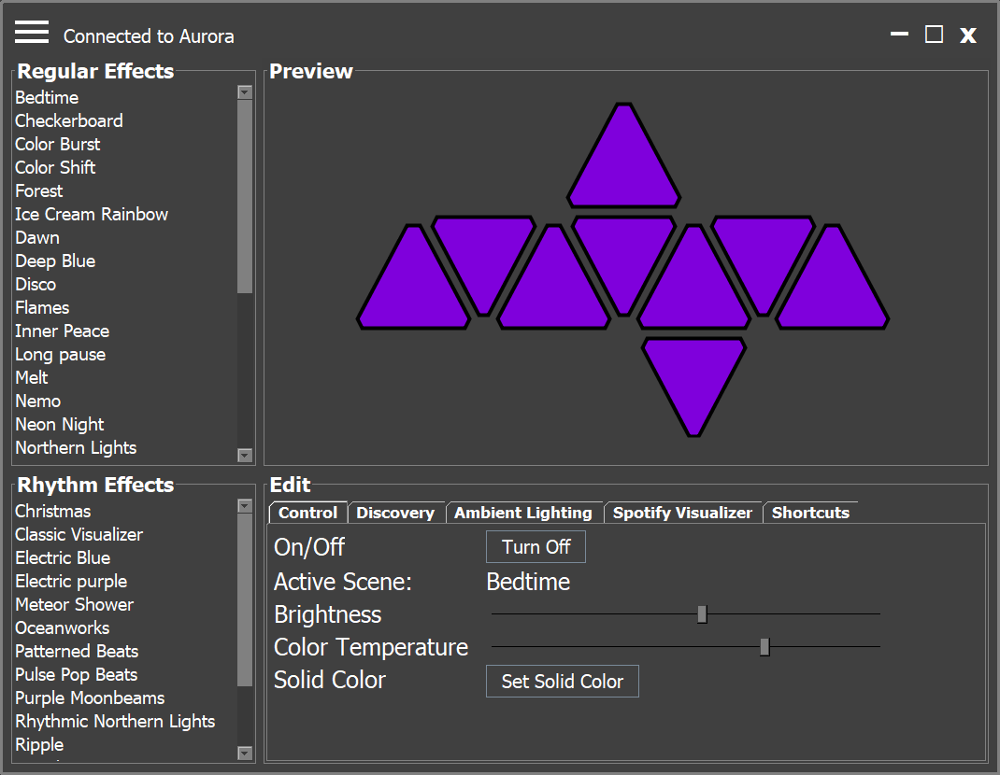

# Nanoleaf for Desktop </img>
Looking for a desktop alternative to the Nanoleaf mobile app? Look no further. Now you can control your devices from your computer on Windows, Mac, and Linux.

## Installation
No installation necessary! Simply download the latest release from the [releases page](https://github.com/rowak/nanoleaf-desktop/releases) and run the .jar file. If you are on Windows or Mac, you can also download their platform-specific executable files. **This application requires Java, so make sure that you have at least java 8 installed.**

## Features
- Select regular and rhythm scenes, set solid colors, and modify the brightness and color temperature
- Control both Aurora and Canvas devices
- Live and responsive preview of the panels to show what is currently displayed on the physical device
- Discover new scenes and plugins created by other Nanoleaf users
- Control devices from a computer outside your local network
- Control multiple devices as one with group mode
- Ambient lighting with two modes, customizable capture zones, and multi-monitor support
- Spotify integration to sync your lights with your music (works *without* rhythm module)
- Custom dark modern UI

## Ambient Lighting
The ambient lighting feature allows your panels to display what is currently on your computer in real time. This can be used to enhance your experience while watching movies, playing games, or listening to music (with an audio visualizer). This feature supports *some* multi-monitor setups, and allows you to set specific "zones" on your screen to be captured instead of the entire screen at once.

Ambient lighting has two modes:
- **Average**: Displays the average color of your screen/zone.
- **Selection**: Maps the device's panels to the screen/zone and sets each panel color based on its mapped location (you have to try it to understand).

## Spotify Integration
This feature allows you to synchronize your Spotify music with your Nanoleaf lights in real time. This feature does *not* require the rhythm module to function, and it does *not* support rhythm effects downloaded from the Nanoleaf mobile app.

The currently available effects include:
- **Pulse Beats**: Changes the color of a single panel for each beat and creates a ripple around that panel that radiates outward to all other panels.
- **Soundbar**: Creates a pulsating bar emanating from the top, bottom, left, or right. Reacts to changes in rhythm.
- **Fireworks**: Creates multiple randomly colored pulses for each beat that quickly flash in then fade out.
- **Streaking Notes**: Creates streaks of colorful light from one edge of the panels to the other. Reacts best to songs with prominent  notes and no overwhelming "noise".

More effects will be added soon.

## Panel Preview
The panel preview displays a live* preview of your device's panels. The preview panels can be **moved around**, **rotated**, and **zoomed** on the screen. Move the panels by holding down left click and dragging the mouse anywhere in the preview window. Rotate the panels by holding down right click in the preview window and moving the mouse right or left. Zoom in or out using the mouse scroll wheel.

_*This is a work in progress. The panel preview can currently only display "static" type and "custom" type effects. Dynamic and rhythm effects are not yet supported. The ambient lighting preview is also not currently supported._

## Screenshots

An example of a custom effect being displayed on the live preview (below).

## Support
[Donate (Paypal)](https://paypal.me/rowak)

## Used Libraries
- [nanoleaf-aurora](https://github.com/rowak/nanoleaf-aurora)
- [http-request](https://github.com/kevinsawicki/http-request)
- [nanohttpd](https://github.com/NanoHttpd/nanohttpd)
- [spotify-web-api-java](https://github.com/thelinmichael/spotify-web-api-java)
- [JSON-java](https://github.com/stleary/JSON-java)
- [jnativehook](https://github.com/kwhat/jnativehook)

## Planned Features
- More Spotify rhythmic effects
- Create static and custom effects and edit existing dynamic effects
