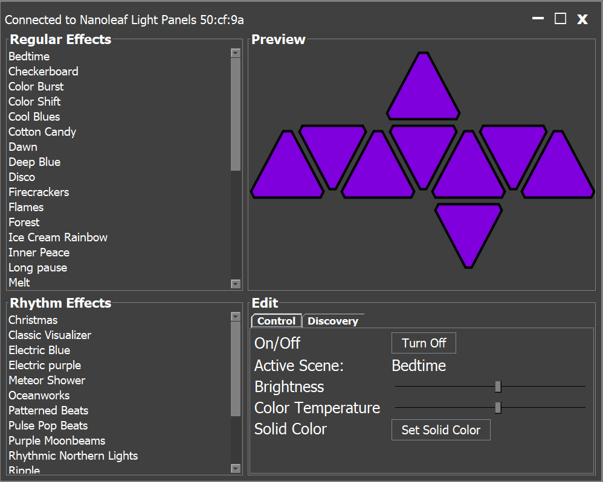

# Nanoleaf for Desktop </img>
Tired of pulling out your phone when you want to change the scene or even just the brightness on your Nanoleaf device? Now you can control your devices from your computer on Windows, Mac, and Linux.

## Installation
Simply download the latest release from the [releases page](https://github.com/rowak/nanoleaf-desktop/releases) and run the .jar file. This application requires Java, so make sure that you have at least java 8 installed. **Note that this is currently a pre-release and there are likely bugs. Please report any problems you find by creating a new issue on GitHub.**

## Features
- Select regular and rhythm scenes, set solid colors, and modify the brightness and color temperature
- Live and responsive preview of the aurora panels to show what is currently displayed on the physical aurora
- Discover new scenes and plugins created by other Nanoleaf users
- Custom dark modern UI

## Screenshots

## Planned Features
- Support for the Nanoleaf Canvas
- Support for controlling multiple auroras
- Create static effects and edit existing dynamic effects
- Streaming audio from other applications to the aurora (maybe)
